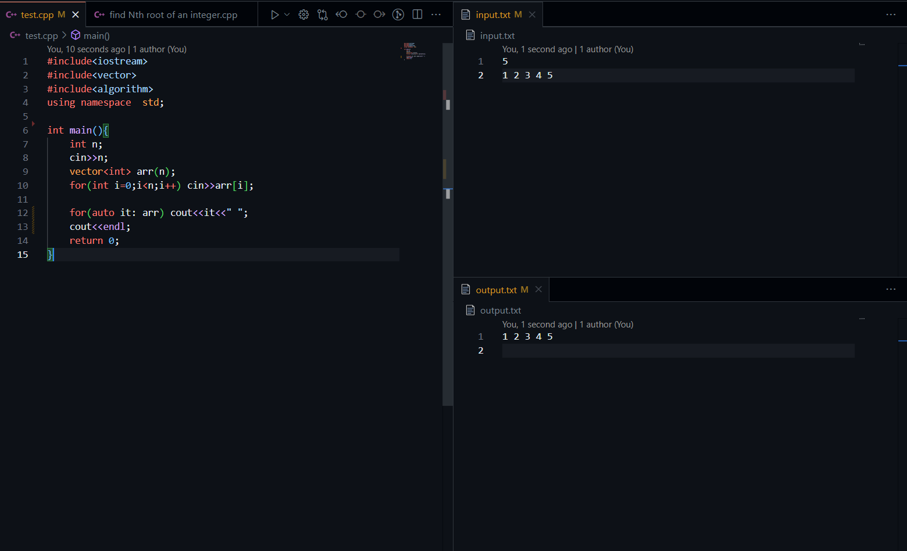

# Data Structures and Algorithms (DSA)

Welcome to the DSA repository! This repository contains various data structures and algorithms implemented in different programming languages.

## Table of Contents

- [Introduction](#introduction)
- [Data Structures](#data-structures)
- [Algorithms](#algorithms)
- [Contributing](#contributing)
- [License](#license)

## Introduction

This repository is aimed at helping you understand and implement various data structures and algorithms. Each implementation is accompanied by explanations and examples.
This is follow up of stariver a2z dsa. [takeuforward](https://takeuforward.org/)

## Data Structures

- Arrays
- Linked Lists
- Stacks
- Queues
- Trees
- Graphs
- Hash Tables
- Heaps

## Algorithms

- Sorting Algorithms
    - Bubble Sort
    - Merge Sort
    - Quick Sort
- Searching Algorithms
    - Binary Search
    - Depth-First Search (DFS)
    - Breadth-First Search (BFS)
- Dynamic Programming
- Greedy Algorithms
- Backtracking

## C++ Implementations

This section contains implementations of data structures and algorithms in C++. Each implementation is well-documented and includes example usage.

### Setting Up VS Code for DSA

To set up Visual Studio Code for working on data structures and algorithms in C++, follow these steps:

1. **Install VS Code**: Download and install Visual Studio Code from [here](https://code.visualstudio.com/).
2. **Install C++ Extension**: Go to the Extensions view by clicking on the Extensions icon in the Activity Bar on the side of the window. Search for "C++" and install the C/C++ extension by Microsoft.
3. **Set Up Compiler**: Ensure you have a C++ compiler installed. You can use MinGW for Windows, or GCC for Linux and macOS. Follow the instructions [here](https://code.visualstudio.com/docs/cpp/config-mingw) to set up MinGW on Windows.
4. **Configure Build Tasks**: Create a `tasks.json` file in the `.vscode` folder to define build tasks. This helps in compiling and running your C++ code directly from VS Code.

### Notes

- **Arrays**: Arrays are a collection of elements stored at contiguous memory locations.
- **Linked Lists**: A linked list is a linear data structure where each element is a separate object.
- **Stacks**: A stack is a linear data structure that follows the LIFO (Last In First Out) principle.
- **Queues**: A queue is a linear data structure that follows the FIFO (First In First Out) principle.
- **Trees**: Trees are hierarchical data structures with a root node and child nodes forming a parent-child relationship.
- **Graphs**: Graphs are collections of nodes connected by edges.
- **Hash Tables**: Hash tables store key-value pairs and use a hash function to compute an index into an array of buckets.
- **Heaps**: Heaps are specialized tree-based data structures that satisfy the heap property.

## **I Will provide hand written notes for DSA**
